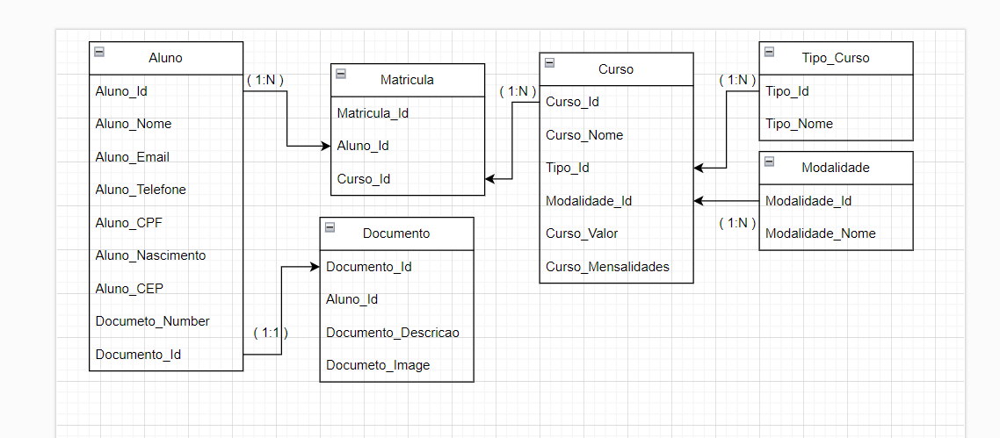

**Descrição do Projeto**
Solicitado a criação de uma aplicação FullStack para resolver demandas quanto a matrículas de futuros alunos numa instituição específica. Esses alunos podem se matricular em mais de um curso, curso esse com possibilidades tanto Presencial, quanto EAD, com tipificação de Graduação e Pós Graduação.

Estrutura do Backend A aplicação utiliza NodeJS para a criação do servidor, com o NestJS como framework web, framework esse, escolhido por sua estrutura modular que facilita a organização do código e a aplicação dos princípios SOLID, resultando em uma arquitetura mais robusta e escalável.

A linguagem TypeScript foi utilizada para garantir um código tipado, proporcionando maior segurança durante o desenvolvimento e facilitando a manutenção e futuras melhorias.

Para manter a consistência e a qualidade do código, foi implementado o ESLint, padronizando a escrita e garantindo que as melhores práticas de programação sejam seguidas. Além disso, foram desenvolvidos testes unitários, assegurando a robustez da aplicação e permitindo uma maior confiança durante o processo de desenvolvimento e nas futuras alterações.

**Modelagem de dados e Relações com MER**

Para o armazenamento de dados da aplicação, foi utilizado um banco de dados relacional e o MySQL Workbench para administração. A escolha por um banco relacional se deu pela necessidade de garantir integridade referencial e a possibilidade de realizar consultas complexas de forma eficiente. Para facilitar a interação com o banco de dados, foi utilizado o ObjectionJS como ORM, proporcionando uma interface intuitiva e simplificada para a manipulação das tabelas e a realização de queries complexas.
A modelagem de dados foi elaborada utilizando um MER, o que permitiu identificar de forma clara as entidades e seus relacionamentos.

Entidades do Sistema

Aluno: Representa os alunos do sistema, contendo informações pessoais como nome, e-mail, telefone, CPF, data de nascimento e CEP.
Documento: Armazena os documentos de identificação dos alunos, como RG ou CNH, incluindo detalhes como número, descrição (RH ou CNH) e imagem do documento.
Matricula: Representa as matrículas realizadas pelos alunos em cursos, vinculando informações sobre o aluno e o curso em que está matriculado.
Curso: Detalha os cursos disponíveis na instituição, incluindo nome, tipo, modalidade, valor total e mensalidades.
Tipo_Curso: Representa as categorias dos cursos oferecidos pela instituição, como Graduação e Pós-Graduação.
Modalidade: Armazena os tipos de modalidade de ensino, como presencial ou EAD.

O MER inclui as seguintes relações, que foram fundamentais para estruturar o banco de dados:

Relações 1:1:
Aluno - Documento: Um aluno possui exatamente um documento associado, garantindo que os dados pessoais estejam diretamente ligados a um documento de identificação.

Relações 1:N:
Aluno - Matrículas: Um aluno pode ter várias matrículas em diferentes cursos.
Curso - Matrículas: Cada curso pode ter diversas matrículas associadas, permitindo que vários alunos estejam matriculados no mesmo curso.
Tipo_Curso - Matrículas: Um tipo de curso pode estar relacionado a diversas matrículas.
Modalidade - Matrículas: Cada modalidade (por exemplo, presencial ou online) pode estar associada a múltiplas matrículas.

**Frontend da Aplicação**
Para o desenvolvimento do frontend, optei pelo NuxtJS juntamente com o VueJS como frameworks. A escolha foi motivada pela necessidade de criar uma aplicação com uma estrutura bem organizada e práticas que favoreçam a manutenção e a escalabilidade do projeto. O NuxtJS facilita o processo de desenvolvimento ao oferecer um sistema de roteamento automático de páginas, simplificando a criação de rotas e ajudando a manter uma estrutura limpa e intuitiva. Além disso, sua abordagem modular permite uma separação clara entre componentes, layouts, middlewares e páginas, seguindo os princípios de organização de código.

A integração com Bootstrap Vue foi escolhida para acelerar o desenvolvimento de interfaces responsivas, permitindo criar rapidamente um design adaptado a diferentes dispositivos, com foco em mobile-first.
